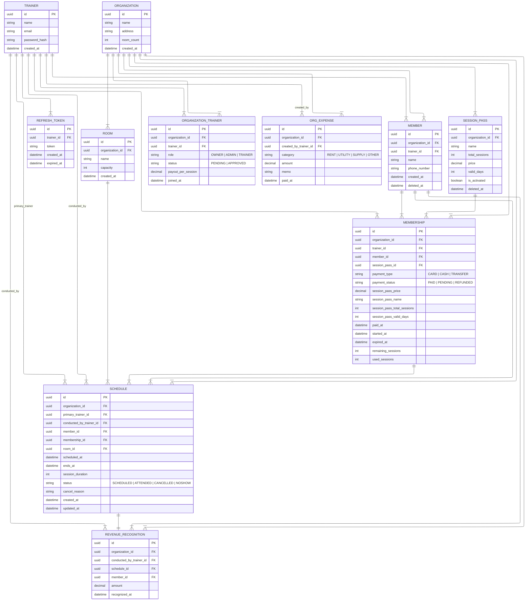

# ER Design

## ERD


## Design Decisions

### Why UUID over int for `id` in tables
IDOR (Insecure Direct Object Reference)
Int IDs are sequential and therefore predictable. An attacker can exploit this predictability by incrementing IDs to enumerate and access other users' data — a pattern that directly leads to BOLA (Broken Object Level Authorization), OWASP API Security Top 1.
Therefore, UUID is more appropriate than int for sensitive resource identifiers, as it eliminates predictability and raises the bar for enumeration attacks.
That said, for public resources — data that carries no sensitivity even if exposed — int remains acceptable, since predictability is not a concern in that context.

### Multi-tenancy: Organization as the Data Boundary

All business data (Members, SessionPasses, Memberships, Schedules, Revenue, Expenses) is scoped to an `Organization`, not to an individual `Trainer`.

**Why not trainer-scoped?**
Trainer-scoped ownership breaks down as soon as a studio has more than one trainer. If Member data lives under a specific trainer, substitution sessions become impossible — Trainer B cannot access Trainer A's member without violating BOLA. Moving ownership up to the Organization level allows all approved trainers within the org to access shared resources while still isolating data from other organizations.

**BOLA defense: dual-key check (`organizationId` + `trainerId`)**
A trainer can belong to multiple organizations (e.g., freelancers). Filtering by `organizationId` alone is insufficient — a trainer could pass a valid `organizationId` for an org they don't belong to. Every request must verify two conditions:
1. The resource's `organizationId` matches the requested org
2. The authenticated trainer has an `APPROVED` membership in that org (`ORGANIZATION_TRAINER`)

Only when both conditions pass is access granted. Failing either returns 404.

### Organization Join Flow & RBAC

| Role | Permissions |
|------|-------------|
| `OWNER` | Full CRUD on all org resources; manage admins and trainers; cannot be removed |
| `ADMIN` | Full CRUD on all org resources; manage trainer invitations |
| `TRAINER` | Read/write on sessions, schedules; read-only on financial data |

> `MEMBER` was intentionally avoided as a role name — it conflicts with the domain term `Member` (a paying client of the studio).

- A trainer creates an organization → automatically assigned `ADMIN`
- Additional trainers join via invitation → status starts as `PENDING`, ADMIN approves → `APPROVED`
- Only `APPROVED` trainers can access org data

### Substitution Trainer Fields on `SCHEDULE`

`SCHEDULE` carries two trainer references:

| Field | Purpose |
|-------|---------|
| `primary_trainer_id` | The trainer originally responsible for this member/membership |
| `conducted_by_trainer_id` | The trainer who actually delivered the session |

When no substitution occurs, both fields point to the same trainer.

**Why this matters for revenue:**
`REVENUE_RECOGNITION` records credit against `conducted_by_trainer_id`, not `primary_trainer_id`. This allows per-trainer revenue reporting that accurately reflects who performed the work, which is essential for commission-based compensation models.

### ORG_EXPENSE: Organization-level Expense Tracking

Expenses (rent, utilities, supplies) belong to the organization, not to an individual trainer. The `created_by_trainer_id` field records which trainer logged the expense for audit purposes, but the expense is not "owned" by that trainer.

This separation allows org-level P&L reporting across all trainers and expenses, rather than siloing costs under individual trainers.

### Schedule Overlap Prevention

Two types of overlap checks are required, enforced at different layers:

**1. Trainer double-booking → PostgreSQL exclusion constraint (DB level)**

A trainer can only conduct one session at a time regardless of room capacity.
Enforced at DB level for a hard guarantee under concurrent requests.

```sql
EXCLUDE USING GIST (
  conducted_by_trainer_id WITH =,
  tstzrange(scheduled_at, ends_at) WITH &&
)
WHERE (status NOT IN ('CANCELLED', 'NOSHOW'));
```

**2. Room capacity → Application level (Service layer)**

Rooms support group sessions (`capacity > 1`), so a simple exclusion constraint cannot express "number of concurrent sessions < capacity". This must be checked in the service before creating a schedule:

```
count of active schedules in room during requested time < room.capacity
→ allowed
≥ room.capacity
→ 409 Conflict (room is fully booked)
```

### Why `member_id` is denormalized in `REVENUE_RECOGNITION`
`member_id` can be derived through `SCHEDULE`, but it is included directly to avoid an extra join on frequent monthly revenue aggregation queries. Slight redundancy, intentional trade-off for query simplicity.

### Why not float for financial data
Floats use binary representation internally, which cannot precisely express most decimal fractions — leading to rounding errors that compound over repeated calculations.

Instead, `Decimal` (PostgreSQL `NUMERIC`) is used, which stores exact decimal values and guarantees precise arithmetic — standard practice in any financial system.

### JWT Token Management Strategy

**Access Token** — no DB storage
- Short-lived (15 min) and stateless
- If compromised, damage is minimal due to short expiry
- If revocation is required (e.g., account takeover), add to a Redis blacklist with TTL matching token expiry — not implemented in this project
- Storing in DB causes performance bottlenecks since every API request would require a DB lookup

**Refresh Token** — stored in DB
- Long-lived (7–30 days), stored in DB to enable logout and forced invalidation
- On logout: delete from DB
- On token refresh: validate against DB before issuing new tokens
- On suspected compromise: delete from DB to immediately invalidate

**Why this split?**
- Access token handles authentication on every request → keep it fast and stateless
- Refresh token handles session lifecycle → needs server-side control for security

### Unified Schedule Model (No Separate Attendance Table)
Initially considered separate Attendance and Schedule tables, but consolidated into a single entity with a state machine (`SCHEDULED → ATTENDED | CANCELLED | NOSHOW`). This reduces data inconsistency risk, simplifies BOLA authorization checks, and better reflects the domain reality where a PT session is a single lifecycle event.

### Soft Delete Strategy for Members

Members are never hard-deleted. Instead, a `deleted_at` timestamp is set to preserve historical data (revenue records, session history).

- If the member has an active (non-expired) membership, deletion is blocked with a `409 Conflict` response.
- Once all memberships are expired, the trainer can soft-delete the member.
- Soft-deleted members are excluded from all queries via `WHERE deleted_at IS NULL`.

**Rationale:** Hard-deleting a member would cascade to revenue recognition records, breaking financial reporting integrity.

### Soft Delete & Deactivation Strategy for Session Passes

Session passes follow the same soft delete strategy as members, using a `deleted_at` timestamp. Additionally, an `is_activated` flag controls whether the session pass can be referenced by new memberships.

- If any active (non-expired) membership references the session pass, deletion is blocked with a `409 Conflict` response.
- Once no active memberships reference it, the trainer can soft-delete the session pass.
- The `is_activated` flag can be set to `false` independently of deletion, allowing trainers to stop offering a session pass while keeping it visible in existing memberships.
- Soft-deleted and deactivated session passes are excluded from selection when creating new memberships, but existing memberships that reference them remain unaffected.

**Rationale:** Deleting a session pass would break FK references from existing memberships and corrupt historical pricing data used in revenue calculations.
