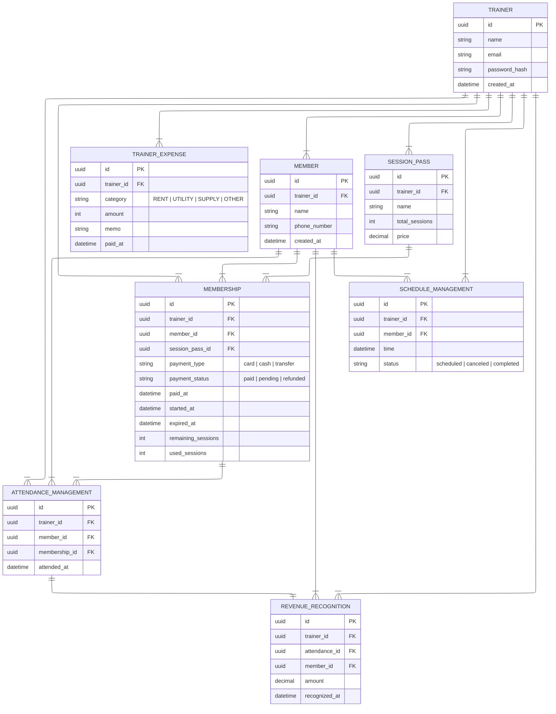

# ER Design

## ERD

## Design Decisions

### Why UUID over int for `id` in tables
IDOR (Insecure Direct Object Reference)
Int IDs are sequential and therefore predictable. An attacker can exploit this predictability by incrementing IDs to enumerate and access other users' data — a pattern that directly leads to BOLA (Broken Object Level Authorization), OWASP API Security Top 1.
Therefore, UUID is more appropriate than int for sensitive resource identifiers, as it eliminates predictability and raises the bar for enumeration attacks.
That said, for public resources — data that carries no sensitivity even if exposed — int remains acceptable, since predictability is not a concern in that context.

### Why `member_id` is denormalized in `REVENUE_RECOGNITION`
member_id can be derived through ATTENDANCE, but I included it directly to avoid an extra join on frequent monthly revenue aggregation queries. Slight redundancy, intentional trade-off for query simplicity.

### Why not float for financial data?
Floats use binary representation internally, which cannot precisely express most decimal fractions - leading to rounding errors that compound over repeated calculations.

Instead, I used `Decimal` (PostgreSQL `NUMERIC`), which stores exact decimal values and guarantees precise arithmetic - a standard practice in any financial system.
