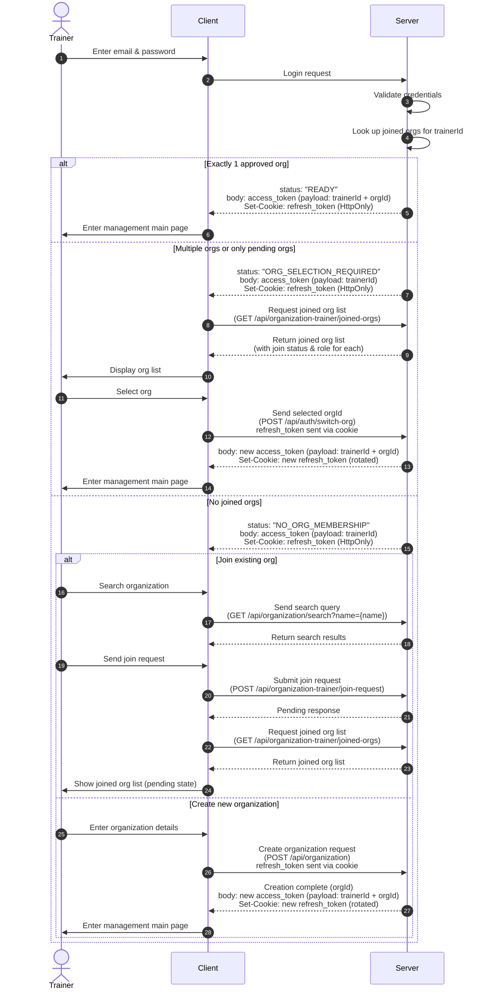

# Trainer Login Sequence Diagram



## Login Response Status Codes

| `status` value | Meaning | Token payload | Frontend action |
|---|---|---|---|
| `READY` | Trainer has exactly 1 approved org; auto-entered | `trainerId + orgId` | Go straight to management main page |
| `ORG_SELECTION_REQUIRED` | Trainer has multiple orgs, or only pending memberships | `trainerId` | Fetch `/joined-orgs`, show selection page |
| `NO_ORG_MEMBERSHIP` | Trainer has no joined orgs at all | `trainerId` | Show search/create org flow |

## Response Shape Example

```jsonc
// Response body
{
  "status": "READY" | "ORG_SELECTION_REQUIRED" | "NO_ORG_MEMBERSHIP",
  "accessToken": "..."
}

// Response header
Set-Cookie: refreshToken=...; HttpOnly; Secure; SameSite=Strict; Path=/api/auth; Max-Age=604800
```

## Notes

- Server is the single source of truth for routing. Frontend does not decode the JWT to decide where to navigate — it just reads `status`.
- Future states can be added without breaking changes: `EMAIL_VERIFICATION_REQUIRED`, `2FA_REQUIRED`, `ACCOUNT_LOCKED`, etc.
- A "switch org" button in the management page should still call `/api/auth/switch-org` for trainers who need to change context after auto-entry.
- For `ORG_SELECTION_REQUIRED`, the client makes a separate `GET /joined-orgs` call to fetch the list — keeps the login response lean and lets the org list endpoint be the single source for org metadata.