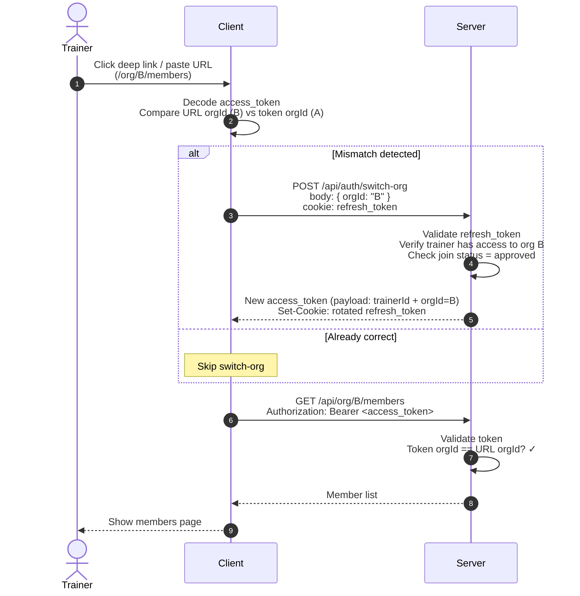
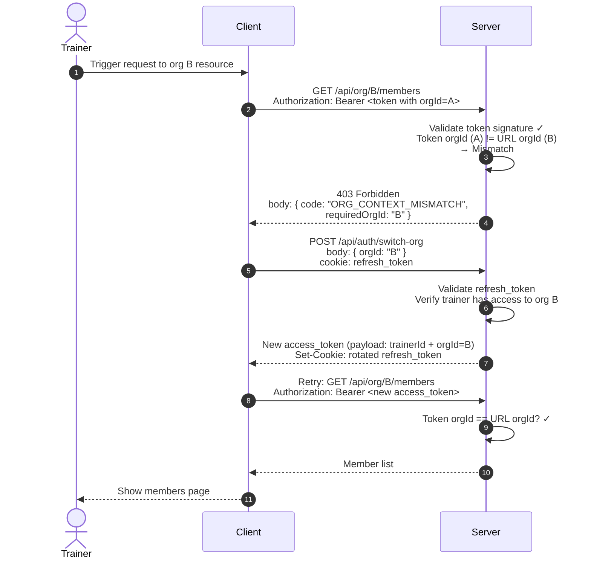
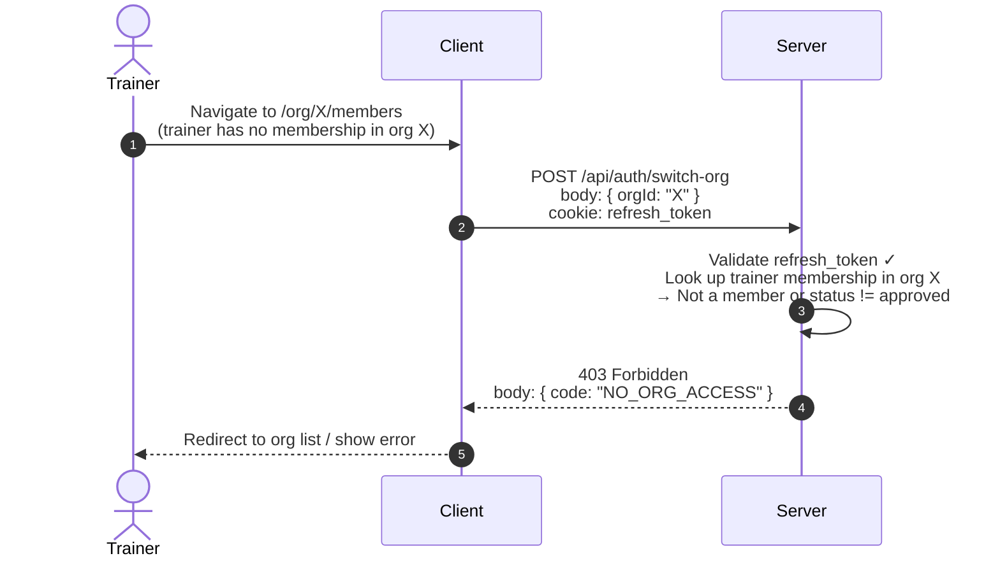

# Org Context Switching Sequence Diagram

When a trainer with access to multiple orgs navigates to a different org's resource, the access token's org context must be switched. The frontend handles routing/UX, the server validates and issues new tokens.

---

## Happy Path: Frontend Pre-checks Token

---

## Fallback Path: Server Detects Mismatch

This handles cases where the frontend pre-check didn't run (direct API call, race condition, stale token, etc.). The server is the final authority.

---

## Failure Path: Trainer Has No Access to Target Org

---

## Status Code Reference

| Code | HTTP | Meaning | Frontend Action |
|---|---|---|---|
| `ORG_CONTEXT_MISMATCH` | 403 | Token's orgId differs from requested resource's orgId | Call `/auth/switch-org` with `requiredOrgId`, retry |
| `NO_ORG_ACCESS` | 403 | Trainer has no membership / not approved in target org | Redirect to org selection or show error |

---

## Server-side Responsibilities

1. **Validate every request** — never trust the client's org context. Compare token's `orgId` with the resource's `orgId` (from URL or request body).
2. **Issue scoped tokens** — `/auth/switch-org` validates membership + status, then issues a token with only the active org.
3. **Rotate refresh_token** — every `/auth/switch-org` call rotates. Reused old refresh tokens trigger session-wide invalidation.
4. **Distinct error codes** — `ORG_CONTEXT_MISMATCH` (token correctable) vs `NO_ORG_ACCESS` (permission denied) so the client can react appropriately.